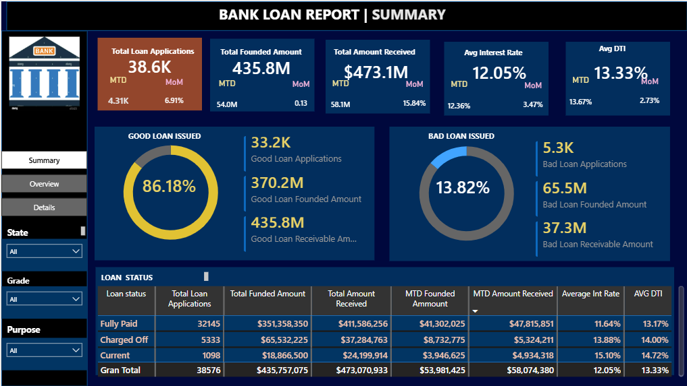
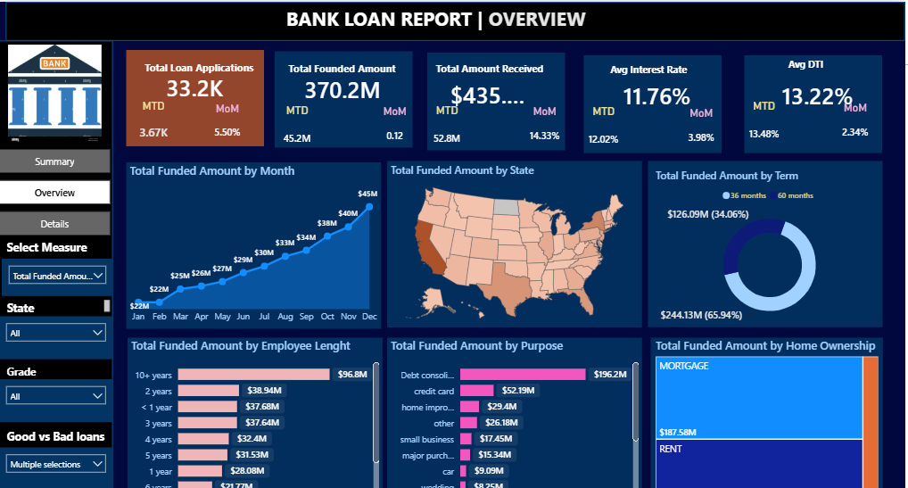
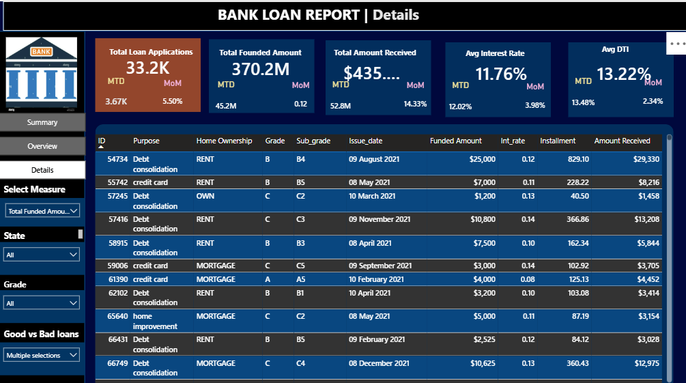

# 🏦 Bank Loan Analysis | Power BI Dashboard
📌 Project Overview

This project presents an end-to-end Bank Loan Analysis developed using Microsoft Power BI.

The objective is to analyze loan application activity, funded amounts, repayments, borrower characteristics, and loan performance in order to identify key trends and provide actionable business insights.

The project transforms raw loan data into an interactive dashboard that allows users to monitor key financial and operational metrics and explore loan performance across different dimensions.

🎯 Business Objective

The main goal of this project is to provide a clear overview of the bank's loan portfolio and answer important business questions such as:

-How many loan applications were submitted?

-How much money was funded?

-How much money was received from borrowers?

-What is the average interest rate?

-What is the average debt-to-income ratio (DTI)?

-What percentage of loans are considered good or bad?

-Which states generate the highest number of loan applications?

-Which loan purposes are most common?

-How does loan performance vary by loan grade?

-How do borrower characteristics affect loan activity?

📊 Key Performance Indicators (KPIs)

The dashboard focuses on several key metrics:

KPI	                                     Description
Total Loan Applications	                 Total number of loan applications

Total Funded Amount	                     Total amount funded by the bank

Total Amount Received                    Total amount received from borrowers

Average Interest Rate	                   Average interest rate across loans

Average DTI	                             Average debt-to-income ratio

Good Loan %	                             Percentage of loans classified as good

Bad Loan %	                              Percentage of loans classified as bad

Good Loan Applications	                Number of applications classified as good

Bad Loan Applications                  	Number of applications classified as bad

Good Loan Funded                         Amount	Amount funded for good loans

Bad Loan Funded                         Amount	Amount funded for bad loans

Good Loan Receivable                   Amount	Amount received from good loans

Bad Loan Receivable                     Amount	Amount received from bad loans

🛠️ Tools & Technologies

Data Analysis & Visualization

Microsoft Power BI

DAX

Power Query

SQL

Excel / CSV

Power BI Features Used

-KPI Cards

-Slicers

-Donut Charts

-Bar Charts

-Area Charts

-Treemaps

-Shape Maps

-Tables

-Page Navigation

-Interactive filtering

-DAX measures

-Month-over-Month (MoM) analysis

-Month-to-Date (MTD) analysis

📑 Dashboard Pages

The Power BI report contains three main analytical pages:

1. Summary

The Summary page provides a high-level overview of the loan portfolio.

It focuses on the main KPIs and compares:

-Loan applications

-Funded amounts

-Amount received

-Interest rates

-Debt-to-income ratio

-Good vs. bad loans

The page also includes MoM (Month-over-Month) and MTD (Month-to-Date) metrics to monitor changes in performance over time.

Main metrics

-Total Loan Applications

-Total Funded Amount

-Total Amount Received

-Average Interest Rate

-Average DTI

-Good Loan %

-Bad Loan %

2. Overview

The Overview page provides a more detailed analysis of loan activity.

The dashboard allows users to explore loan performance by different dimensions, including:

-State

-Loan term

-Employment length

-Loan purpose

-Home ownership

-Loan grade

-Loan status

-Month

Interactive filters allow users to dynamically change the analysis and investigate specific segments of the loan portfolio.

3. Details

The Details page provides a more granular view of individual loan records.

The analysis includes fields such as:

*Loan ID
*Loan purpose
*Home ownership
*Grade
*Sub-grade
*Issue date
*Funded amount
*Interest rate
*Installment
*Amount received
*Loan status

This page can be used to drill down from high-level KPIs into individual loan-level information.

📈 Analytical Approach

The project follows a structured data analysis workflow.

1. Data Preparation

The raw bank loan dataset was prepared and transformed before being used for analysis.

Typical preparation steps included:

*Data cleaning

*Data type validation

*Handling missing values

*Formatting dates

*Creating analytical fields

*Preparing data for Power BI

2. Data Modeling

The data model was structured to support interactive analysis and DAX calculations.

The main dataset used in the Power BI model is:

[financial_loan.csv](./financial_loan.csv)

The model contains information related to:

Loan applications
Loan amounts
Interest rates
Borrower characteristics
Loan grades
Loan purposes
Loan status
Dates
Geographic information

3. DAX Measures

Several DAX measures were created to calculate the main business KPIs.

Examples include measures for:

Total Loan Applications
Total Funded Amount
Total Amount Received
Average Interest Rate
Average DTI
Good Loan %
Bad Loan %
Month-over-Month changes
Month-to-Date performance

These measures allow the dashboard to update dynamically when users interact with filters and slicers.

🔎 Key Analysis Areas

Loan Performance

The analysis compares Good Loans vs. Bad Loans to understand the overall quality of the loan portfolio.

Metrics include:

Number of applications

Funded amount

Amount received

Percentage of total loans

Geographic Analysis

Loan applications and performance can be analyzed by state, allowing the identification of geographic patterns in loan activity.

Loan Purpose

The dashboard analyzes the most common purposes for which customers apply for loans.

Examples include categories such as:

Debt consolidation

Credit card

Home improvement

Major purchase

Small business

Other purposes

Borrower Characteristics

The analysis also considers borrower characteristics such as:

Employment length
Home ownership
Loan grade
Sub-grade

These dimensions can help identify patterns in loan demand and performance.

Time Analysis

The dashboard includes time-based analysis to identify changes in loan activity.

The report uses:

Monthly analysis

Month-over-Month (MoM)

Month-to-Date (MTD)

This makes it possible to monitor changes in applications, funding, repayments, interest rates, and DTI over time.

📷 Dashboard Preview

Summary.png
Overview.png
Details.png

💡 Business Insights

The dashboard is designed to help stakeholders identify:

Trends in loan application volume

Changes in funded and received amounts

Differences between good and bad loans

Geographic patterns in loan demand

Popular loan purposes

Differences across loan grades

Borrower characteristics associated with loan activity

Changes in interest rates and DTI over time

Note: Specific numerical insights should be added after validating the final dashboard values and filters.

📌 Project Highlights

This project demonstrates practical skills in:

Data cleaning

Data transformation

Data modeling

SQL analysis

DAX

KPI development

Business intelligence

Data visualization

Interactive dashboard design

Financial data analysis

Business insight generation

🎓 What I Learned

Through this project, I strengthened my ability to:

Transform raw data into an analytical dataset

Build interactive Power BI dashboards

Create meaningful KPIs using DAX

Analyze financial and loan-related data

Design dashboards for business users

Use different visualization techniques to communicate insights

Analyze trends using MoM and MTD calculations

Translate business questions into data-driven analysis
